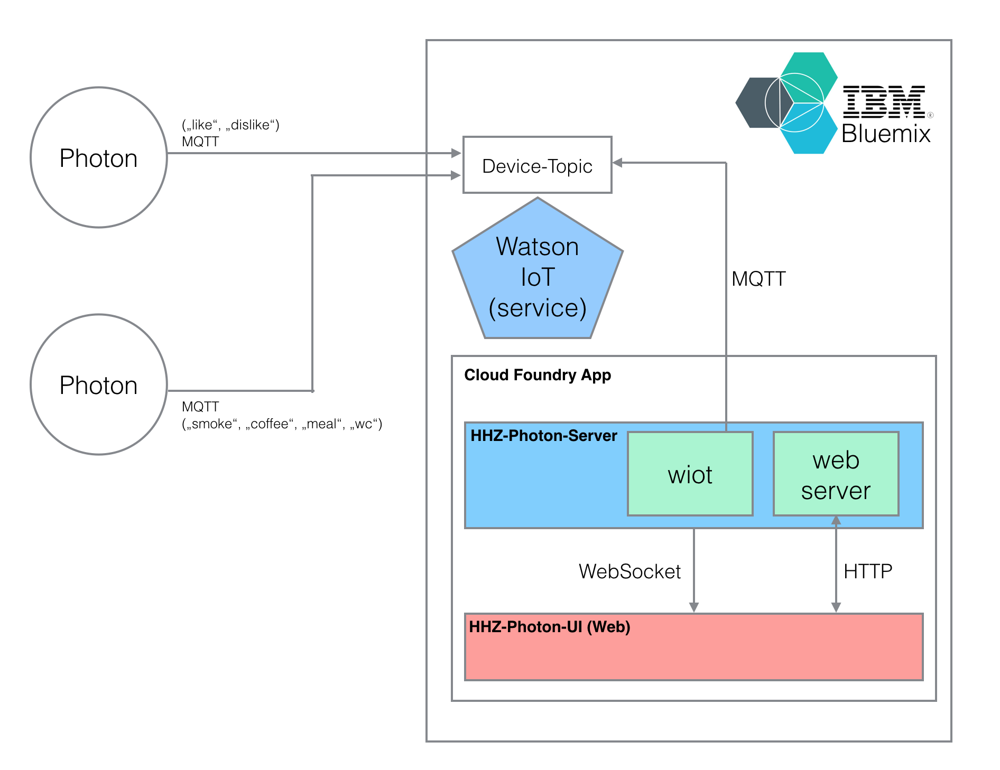

# HHZ IoT Hackathon - Group "Photon Button"

This project is based on the Idea of *physical likes*. Using an internet button, students are able to "like" or "dislike" a lecture by pressing the corresponding button "like" or "dislike". The results are displayed in dashboard on a web UI. Additionally, using a second internet button students are also able to send information when they going to have a coffee, smoke a cigarette, went to have meal, or need to go the bathroom.

The internet button used in this project is the Photon button from Particle. It is an programmable internet button equiped with an WLAN module. Pressing on of four button sends an event which in addition can be processed.

## Implementation

The project is implemented on Bluemix, IBM's Cloud Platform. Bluemix provides a several services for IoT, web, and mobile application with a quick setup and an easy to use experience.

 [IBM Bluemix](https://console.ng.bluemix.net/) and [particle photon iot internet buttons](https://docs.particle.io/datasheets/photon-datasheet/).

### Architecture

